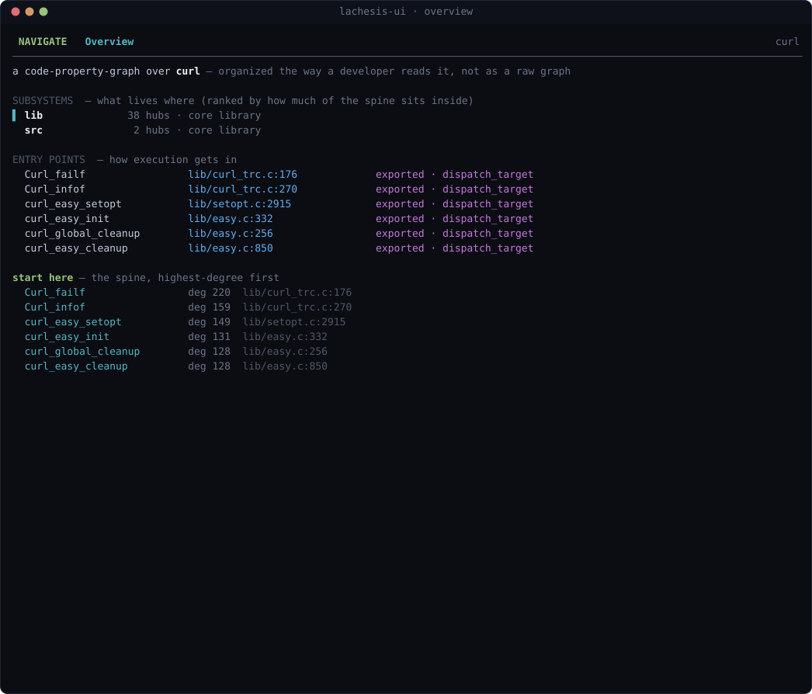
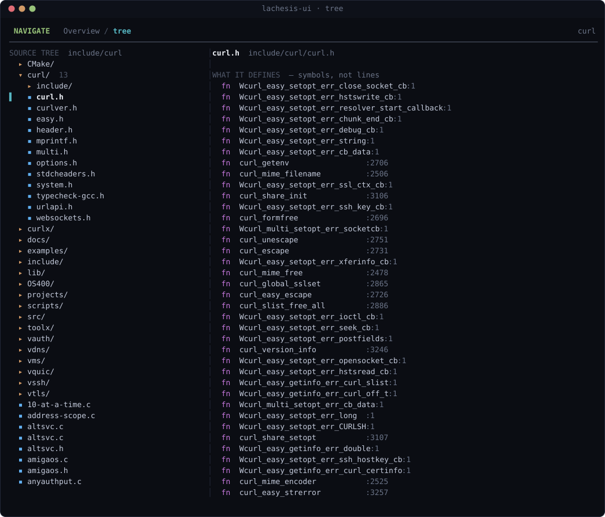
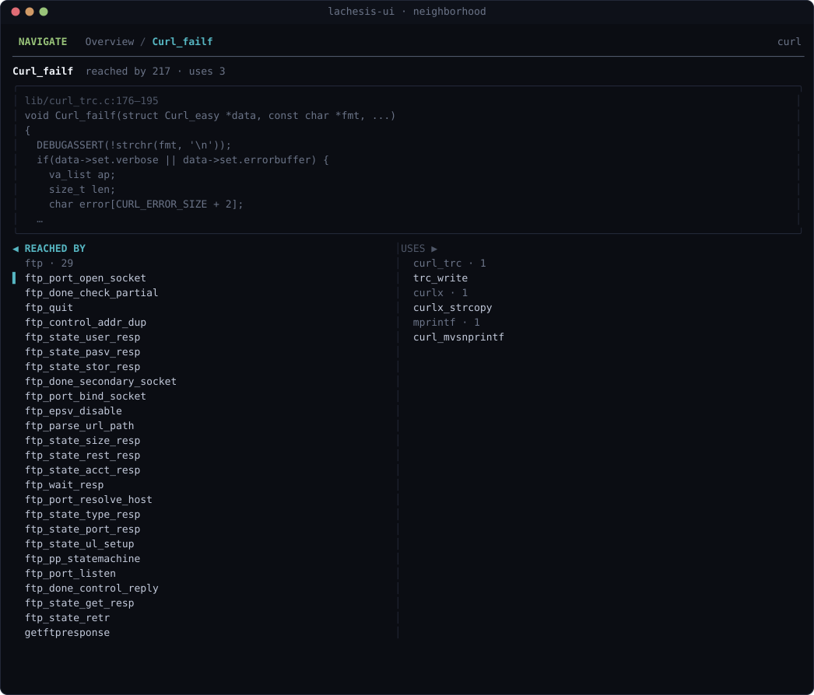

# lachesis-ui

A keyboard-driven terminal UI for navigating a [lachesis](https://github.com/UnboundCompute/lachesis)
code-property-graph, the way a developer reads a codebase rather than as a raw graph.

Release and rollback guidance is in [`RELEASING.md`](RELEASING.md).

You point it at a graph built from any Python, TypeScript, JavaScript, or C
tree and it opens a persistent, k9s-style screen: subsystems and entry points up
front, a source tree with per-file symbol outlines, and a symbol's neighborhood
(who reaches it, what it uses) grouped by module instead of dumped as a flat
list. It is navigation-driven, not a chat box. Every move is a keystroke.

> **Status: v1, navigation only.** Finding and scanning surfaces (the candidate
> registry, taint) land in a later release. This version is the reader.

---

## Screens

Three screens, each a different lens on the same graph (shown here over the curl
source tree).

**Overview**, the map: subsystems ranked by how much of the spine they hold,
the entry points, and the highest-degree nodes as a "start here".



**Tree**, a nested collapsible source tree with the symbol outline of the file
under the cursor alongside it.



**Neighborhood**, a symbol in focus with a source peek and its callers and
callees grouped by module.



---

## How it fits together

The UI is a single Go binary. It does not analyze code itself. It spawns the
lachesis **engine** (Python) over [MCP](https://modelcontextprotocol.io) and
renders what the engine reports. So a working setup is two moving parts:

```
  lachesis-ui  --spawns-->  python -m lachesis.nav.mcp_server <graph.kuzu>
   (this repo)   (stdio        (the engine: builds and serves the code graph,
                  JSON-RPC)      reading sink models from the atropos catalog)
```

Because the two talk over MCP at arm's length (separate processes, a stdio
JSON-RPC protocol), the UI is a client of the engine, not a derivative of it.
That is why the licenses differ. See [License](#license).

The `install.sh` below pulls and builds all three pieces (the engine, the
atropos catalog, and this UI) and wires them into the standard `~/.lachesis`
layout the binary already knows how to discover.

---

## Install

### One command (pulls and builds the whole stack)

```sh
git clone https://github.com/UnboundCompute/lachesis-ui
cd lachesis-ui
./scripts/install.sh
```

This clones and builds:

| piece | repo | role |
|-------|------|------|
| engine | `UnboundCompute/lachesis` | the code-graph builder, nav layer, and MCP server |
| catalog | `UnboundCompute/atropos` | the sink/taint models the engine reads (cloned as a sibling, auto-discovered) |
| UI | this repo | the Go terminal binary |

and lays them out as:

```
~/.lachesis/src/lachesis      engine checkout
~/.lachesis/src/atropos       catalog checkout
~/.lachesis/venv              engine virtualenv  (the UI's default interpreter)
~/.lachesis/graphs            built graphs land here  (the UI's default search dir)
~/.lachesis/bin/lachesis-ui   the UI binary
~/.lachesis/build-graph.sh    helper to build a graph from any source tree
```

The installer also vendors Lachesis's pinned TypeScript compiler, so the resulting
stack can analyze TypeScript without a separate Node/npm setup.

Re-running `install.sh` updates the checkouts in place. Requirements: `git`,
`python3` (3.10+), and Go 1.24.2+ to build the binary.
The installer takes an atomic lock, so concurrent invocations fail safely rather than
mutating the shared virtualenv and checkouts at the same time.

The UI bounds each MCP tool request to two minutes so a stalled engine cannot leave the
terminal waiting forever. For unusually expensive local graphs, override it with a Go
duration such as `LACHESIS_UI_REQUEST_TIMEOUT=5m`; a timed-out request terminates the
engine and shows the recent engine diagnostics.

To keep the stack outside your home directory (for example, on a CI volume), set
`LACHESIS_HOME`; the generated graph helper and UI discovery use the same root:

```sh
LACHESIS_HOME=/var/cache/lachesis ./scripts/install.sh
```

For reproducible deployments, pin the engine and catalog before installing (use
reviewed tags or commit SHAs rather than mutable branches). Re-running the
installer applies those refs to existing clean checkouts and refuses to touch a
checkout with local edits or untracked files:

```sh
LACHESIS_REF=<lachesis-tag-or-sha> ATROPOS_REF=<atropos-tag-or-sha> ./scripts/install.sh
```

The installer pins its binary fallback to `v0.1.0`; set `LACHESIS_UI_REF` to a
reviewed tag or commit when selecting another UI release.

When building from the checkout, set `LACHESIS_UI_VERSION` if the binary should report
a version other than the default `0.1.0`:

```sh
LACHESIS_UI_VERSION=1.2.0 ./scripts/install.sh
```

Then put the binary on your PATH:

```sh
export PATH="$HOME/.lachesis/bin:$PATH"
```

### Just the binary

If you already have the engine installed (`~/.lachesis/venv`, or `lachesis` on
your PATH), you only need the UI:

```sh
go install github.com/UnboundCompute/lachesis-ui@v0.1.0
```

Replace `v0.1.0` with the reviewed release tag you intend to deploy; avoid
`@latest` in production automation.

### Not pip or npm

`lachesis-ui` is a static Go binary, so it is **not** a pip or npm package. The
engine it drives is Python (`python -m pip install -e` from the checkout, which
`install.sh` does for you). Tagged releases build Linux and macOS binaries for
amd64 and arm64 in the `release binaries` workflow. Download the matching archive
and verify its SHA-256 checksum before unpacking it:

```sh
sha256sum -c SHA256SUMS --ignore-missing
```

On macOS, use `shasum -a 256 -c SHA256SUMS` instead.

A Homebrew tap is still planned.

---

## Quick start

Build a graph from any source tree, then launch:

```sh
# 1. build a graph (prints the store path)
~/.lachesis/build-graph.sh /path/to/some/repo [name]

# 2. open it. With no args, the UI picks the newest graph you've built
lachesis-ui

# or point at one explicitly
lachesis-ui --graph ~/.lachesis/graphs/somerepo.kuzu
```

The optional `name` is a single graph-name component; `/`, `\\`, `.`, and `..` are
rejected so output stays under `~/.lachesis/graphs` (or your configured
`LACHESIS_HOME`).

The first screen you touch triggers a one-time graph load (a few seconds for a
large tree); after that every move is instant.

---

## Keys

| key | does |
|-----|------|
| `↑ ↓` / `k j` | move the selection |
| `→` | expand a folder in place |
| `←` | collapse a folder, or jump to its parent |
| `enter` | open: toggle a folder, or jump into a symbol's neighborhood |
| `1` / `o` | Overview: subsystems, entry points, the spine |
| `2` / `t` | Tree: source tree plus per-file symbol outline |
| `3` | Neighborhood: the last symbol you opened |
| `tab` | switch panes in the neighborhood (reached-by and uses) |
| `/` | search for a symbol by name |
| `q` | quit |

---

## The three screens

- **Overview** is the map. Subsystems ranked by how much of the graph's spine
  sits inside them, the entry points execution gets in through, and the
  highest-degree nodes as a cold-start "start here".
- **Tree** is the source tree as a nested, collapsible outline. Folders expand
  in place (collapsed by default, so a large repo opens as a handful of
  top-level folders, not a wall of files), and alongside it sits the symbol
  outline of the file under your cursor (what it defines, not its lines).
- **Neighborhood** is a symbol in focus with a source peek, and its callers and
  callees grouped by module (`http · 22`, `ftp · 21`, and so on) so a
  150-caller hub reads as a distribution across the codebase, never a flat wall.

---

## Flags

```
lachesis-ui [flags] [graph.kuzu]

  --graph PATH     prebuilt .kuzu store (default: newest in ~/.lachesis/graphs)
  --python PATH    interpreter that runs the engine (default: auto-discover)
  --list           list discovered graphs and exit
  --version        print version and exit
```

**Engine discovery** order: `$LACHESIS_PYTHON`, then `~/.lachesis/venv/bin/python`,
then `python3` or `python` on PATH.

Engine startup is bounded to five minutes by default while a large graph loads. Set
`LACHESIS_UI_STARTUP_TIMEOUT` to a Go duration such as `10m` when a larger codebase
needs more time; an expired startup terminates the child and reports an actionable
error.

---

## Contributing

Contributions are welcome. See [CONTRIBUTING.md](CONTRIBUTING.md) for how to set
up the stack, the code layout, and what CI checks before a merge. By
participating you agree to the [Code of Conduct](CODE_OF_CONDUCT.md).

From a checkout, `make check` runs the same formatting, vet, build, and test gate as CI.

---

## License

The UI in this repository is licensed under the [MIT License](LICENSE).

It drives the lachesis **engine**, which is licensed separately under
AGPL-3.0-or-later. The UI is a client that talks to the engine over MCP at arm's
length (a separate process, a stdio JSON-RPC protocol), so it is not a
derivative work of the engine and carries its own permissive license. Running
the combined stack as a network service still invokes the engine's AGPL
obligations for the engine's own source. In short: this UI is MIT, the engine it
launches is AGPL, and the boundary between them is the MCP protocol.
